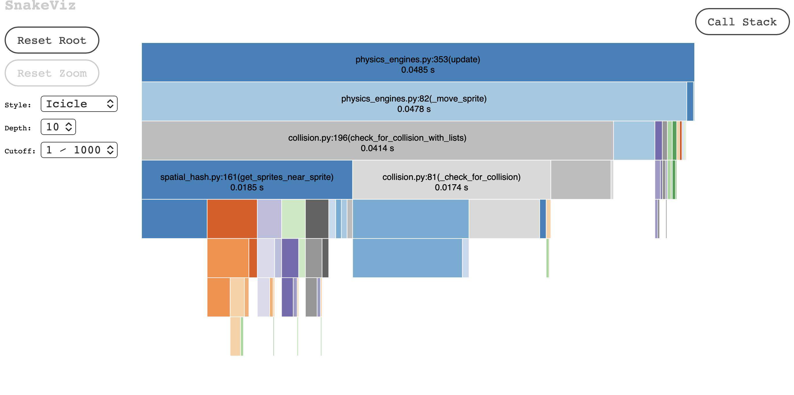
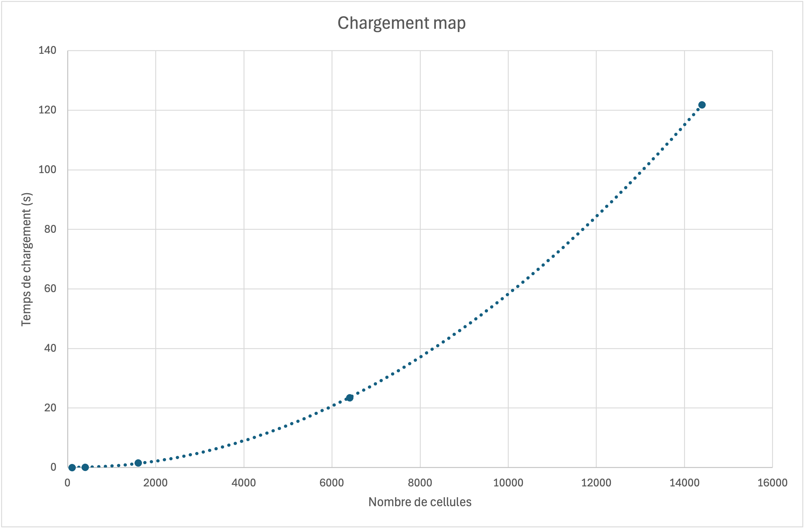
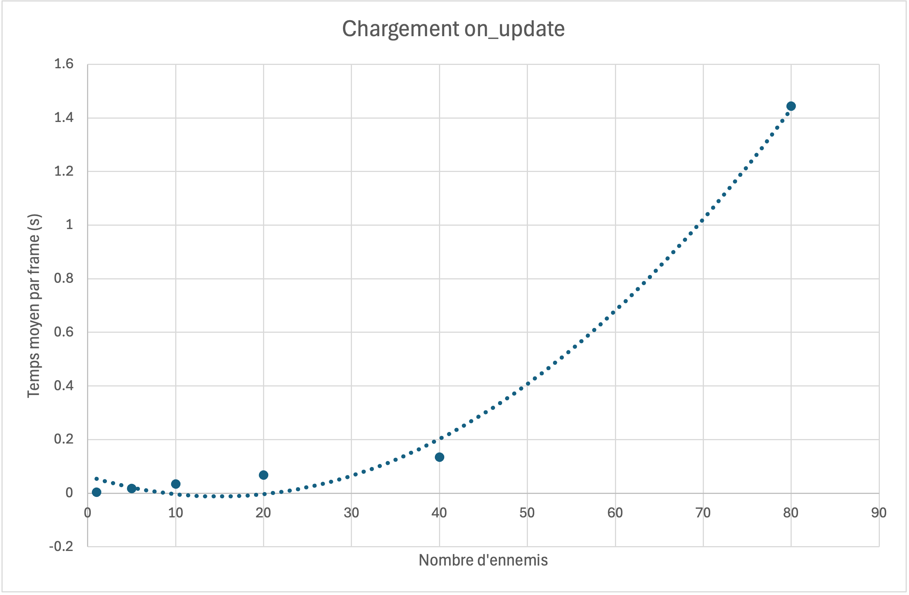

### <u>Analyse Algorithimique:</u>
### Complexité du chargement de la map : densité du navmesh

On note $n = \text{width} \times \text{height}$ le nombre total de cellules de la carte. On note aussi $d$ la densité du navmesh, c’est-à-dire le nombre de nœuds créés par côté dans une cellule. Dans notre implémentation, une cellule libre contient donc $d^2$ nœuds. La lecture de la carte elle-même demande de parcourir toutes les cellules, donc cette partie est en $\Theta(n)$. La construction du navmesh est plus coûteuse, car pour chaque cellule accessible, on crée jusqu’à $d^2$ nœuds. Le nombre total de nœuds du navmesh est donc $V = \Theta(d^2 n)$. Ensuite, chaque nœud est relié à un nombre borné de voisins, au maximum 8 dans notre cas. Le nombre d’arêtes est donc aussi $E = \Theta(d^2 n)$. Le coût principal du chargement lié au navmesh est alors $\Theta(V+E)=\Theta(d^2 n)$. Si $d$ est fixé, par exemple $d=3$, alors cette complexité redevient linéaire en la taille de la carte, donc $\Theta(n)$. En revanche, si on augmente $d$, le coût augmente quadratiquement en $d$. Passer de $d=1$ à $d=3$ multiplie approximativement le nombre de nœuds par 9. Cela rend le navmesh plus précis, mais augmente le temps de construction et la mémoire utilisée. Cette analyse correspond bien à notre choix de conception, car le navmesh est construit une seule fois au chargement de la carte. Le joueur ne paie donc pas ce coût à chaque frame. Le compromis est donc acceptable : on augmente un coût ponctuel pour obtenir de meilleurs chemins pendant le jeu. Les benchmarks devront vérifier que le temps de chargement augmente bien à peu près proportionnellement à $d^2 n$.

### Complexité de `on_update` : nombre d’ennemis actifs

On note $m$ le nombre total d’ennemis actifs sur la carte. Dans notre jeu, `on_update` doit mettre à jour le joueur, les cristaux, les spinners, les chauves-souris, les slimes, les armes et les collisions. Si on se concentre sur les ennemis, chaque spinner ou chauve-souris demande essentiellement un nombre constant d’opérations par frame. Leur déplacement est donc en $\Theta(1)$ par ennemi, soit $\Theta(m)$ pour tous les ennemis simples. Les collisions avec le joueur et les projectiles ajoutent aussi un coût qui dépend du nombre de sprites testés. Arcade utilise des structures comme les `SpriteList` et parfois un spatial hash, ce qui évite de comparer naïvement tous les objets entre eux. Cependant, plus il y a d’ennemis, plus il y a de sprites à mettre à jour et à tester. Pour les slimes, le cas normal est aussi peu coûteux : s’ils suivent déjà un chemin, ils avancent vers le prochain nœud en $\Theta(1)$. Le cas coûteux arrive lorsqu’un slime doit calculer un nouveau chemin. Dans ce cas, NetworkX calcule un plus court chemin dans le navmesh. Si $V$ est le nombre de nœuds et $E$ le nombre d’arêtes, ce calcul peut coûter environ $O((V+E)\log V)$ car NetworkX utilise un algorithme de plus court chemin de type Dijkstra et dans Dijkstra chaque nœud peut être extrait une fois de la file de priorité, chaque arête peut être examinée une fois et les opérations sur la file de priorité coûtent environ $\log V$. Dans le pire cas, si plusieurs slimes recalculent un chemin pendant la même frame, le coût peut devenir $O(s(V+E)\log V)$, où $s$ est le nombre de slimes qui recalculent leur chemin. En pratique, ce pire cas est rare, car un slime ne recalcule pas son chemin à chaque frame. La plupart du temps, il suit un chemin déjà calculé. On peut donc distinguer le coût courant, proche de $\Theta(m)$, et le coût exceptionnel, dominé par les recalculs de chemin. Le profiling réalisé avec SnakeViz confirme que le temps de `on_update` est surtout dominé par le moteur physique et les collisions Arcade, plutôt que par le pathfinding.  On observe notamment que les fonctions `physics_engines.update`,`check_for_collision_with_lists` et `get_sprites_near_sprite`consomment la majorité du temps d’exécution. Cela est cohérent avec le fait que les collisions sont recalculées à chaque frame pour de nombreux sprites. Les benchmarks devront donc faire varier le nombre d’ennemis pour vérifier si le temps moyen de `on_update` augmente approximativement linéairement, sauf lorsque beaucoup de slimes recalculent simultanément leurs chemins.

### <u>Benchmarks:</u>
Nous avons réalisé deux benchmarks correspondant aux deux analyses de complexité précédentes.

### Chargement de la map

Pour ce benchmark, nous avons fait varier la taille de la carte, donc le nombre total de cellules. Pour chaque taille, nous avons mesuré le temps nécessaire à la construction du navmesh et au chargement complet de la map.

Les résultats montrent que le temps de chargement augmente très rapidement avec la taille de la carte. La croissance observée est nettement plus rapide qu’une croissance linéaire, ce qui correspond à notre analyse théorique. En effet, lorsque le nombre de cellules augmente, le nombre de nœuds et d’arêtes du navmesh augmente également fortement.

Les mesures obtenues sont cohérentes avec une complexité approximativement quadratique ou supérieure pour les grandes maps. Cela montre que notre code pour le Navmesh n'est probablement pas optimisé pour des jeux avec des maps beaucoup plus grandes.

### on_update

Pour ce benchmark, nous avons fait varier le nombre d’ennemis présents sur la carte et mesuré le temps moyen d’exécution d’une frame de `on_update`.

Les résultats montrent que le coût de `on_update` augmente avec le nombre d’ennemis. Cependant, l’augmentation reste raisonnable pour un nombre modéré d’ennemis.

Le profiling réalisé avec SnakeViz confirme que le temps de `on_update` est principalement dominé par le moteur physique et les collisions Arcade (`physics_engines.py`, `collision.py`), plutôt que par le pathfinding lui-même.

Même avec plusieurs dizaines d’ennemis, le temps moyen par frame reste largement inférieur à 16 ms dans la plupart des cas, ce qui permet de conserver un affichage fluide à 60 FPS.

